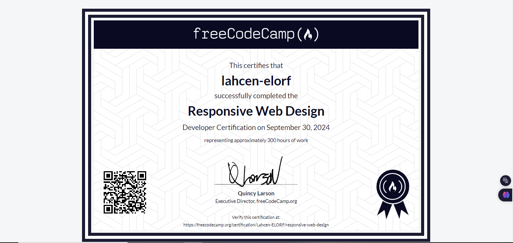

---
<h1 align="center">🖥️ My Responsive Web Design Projects</h1>

- **Certification:** Responsive Web Design from freeCodeCamp  
- **Duration:** 300 hours  
- **Projects:** 20 responsive web design projects  

---

## 🌟 Overview

This repository contains **20 projects** and assignments completed as part of the **Responsive Web Design** certification from freeCodeCamp, a **300-hour** course. It includes a variety of exercises and projects that demonstrate my understanding and application of modern web design principles, such as:

- Responsive layouts 📐
- Flexbox and Grid 🧩
- Media queries 📱
- Accessibility 🌍

---

## 🗂️ Project Overview

### 1. **Cat Photo App Project** 🐱
A simple web page showcasing cat photos using basic HTML elements.  
📸 **Images:** Located in the `ProjectsImages/[1]CatPhotoAppProject` folder.

### 2. **Cafe Menu Project** ☕
A responsive cafe menu designed with flexbox and grid layouts.  
📸 **Images:** Located in the `ProjectsImages/[2]CafeMenuProject` folder.

### 3. **Colored Markers Project** 🖍️
A project demonstrating color usage and layout with a collection of colored markers.  
📸 **Images:** Located in the `ProjectsImages/[3]ColoredMarkersProject` folder.

### 4. **Registration Form Project** 📝
A responsive registration form with various HTML input elements for different data types.  
📸 **Images:** Located in the `Projects Images/RegistrationFormProject` folder.

### 5. **Survey Form Project** 📋
A form designed to gather user feedback, applying responsive design principles.  
📸 **Images:** Located in the `ProjectsImages/[4]SurveyFormProject` folder.

### 6. **Rothko-style Rectangular Art Pieces Project** 🎨
A web page inspired by Rothko-style art, displaying rectangular pieces in different colors.  
📸 **Images:** Located in the `Projects Images/Rothko-styleRectangularArtPiecesProject` folder.

### 7. **Responsive Photo Gallery Webpage Project** 📷
A responsive photo gallery that adjusts layout across different screen sizes.  
📸 **Images:** Located in the `ProjectsImages/[5]ResponsivePhotoGalleryWebpageProject` folder.

### 8. **Nutrition Label Webpage Project** 🍽️
A nutrition label page mimicking real product labels, built using HTML and CSS.  
📸 **Images:** Located in the `ProjectsImages/[6]NutritionLabelWebpageProject` folder.

### 9. **Quiz Webpage Project** ❓
A fun quiz webpage with a multiple-choice format and responsive design.  
📸 **Images:** Located in the `ProjectsImages/[7]QuizWebpageProject` folder.

### 10. **Tribute Page Project** 🎤
A tribute page dedicated to a famous personality, with responsive text and images.  
📸 **Images:** Located in the `ProjectsImages/[8]TributePageProject` folder.

### 11. **Balance Sheet Project** 💼
A webpage displaying a company's balance sheet using tables and responsive layouts.  
📸 **Images:** Located in the `ProjectsImages/[9]BalanceSheetProject` folder.

### 12. **Cat Painting Project** 🎨
A fun and colorful project featuring paintings of cats.  
📸 **Images:** Located in the `ProjectsImages/[10]CatPaintingProject` folder.

### 13. **Piano Project** 🎹
A responsive webpage showcasing a simple piano layout with interactive keys.  
📸 **Images:** Located in the `ProjectsImages/[11]PianoProject` folder.

### 14. **Technical Documentation Page Project** 📄
A technical documentation page built using a navigation sidebar and main content layout.  
📸 **Images:** Located in the `ProjectsImages/[12]TechnicalDocumentationPageProject` folder.

### 15. **City Skyline Project** 🌆
A creative design project showcasing a city skyline using HTML and CSS shapes.  
📸 **Images:** Located in the `ProjectsImages/[13]CitySkylineProject` folder.

### 16. **Magazine Article Project** 📰
A fully responsive article page styled like a magazine, with columns and text wrapping.  
📸 **Images:** Located in the `ProjectsImages/[14]MagazineArticleProject` folder.

### 17. **Product Landing Page** 🛍️
A responsive landing page for a product, including a call-to-action and product features.  
📸 **Images:** Located in the `ProjectsImages/[15]ProductLandingPage` folder.

### 18. **Ferris Wheel Project** 🎡
A fun project showcasing a Ferris wheel design using CSS animations and responsive elements.  
📸 **Images:** Located in the `ProjectsImages/[16]FerrisWheelProject` folder.

### 19. **Happy Flappy Penguin Project** 🐧
A simple interactive game featuring a penguin, built using responsive design techniques.  
📸 **Images:** Located in the `ProjectsImages/[19]HappyFlappyPenguinProject` folder.

### 20. **Personal Portfolio Webpage** 💼
A responsive portfolio webpage to showcase personal projects, skills, and contact information.  
📸 **Images:** Located in the `Projects Images/[20]PersonalPortfolioWebpage` folder.

---

## 🛠️ Technologies Used

- HTML5
- CSS3
- Flexbox & CSS Grid
- Responsive Web Design principles

---

## 📚 How to Use

1. **Clone the repository**:
   ```bash
   git clone https://github.com/ELORF-Lahcen/MyResponsiveWebDesign.git

---

## 🏆 Certification

Upon completion of the **300-hour** course, I earned the **Responsive Web Design** certification from freeCodeCamp. The certification demonstrates my ability to create fully responsive web applications.



---

## 📫 Contact

- LinkedIn: [www.linkedin.com/in/lahcen-elorf-126bb2264](https://www.linkedin.com/in/lahcen-elorf-126bb2264)
- GitHub: [ELORF-Lahcen](https://github.com/ELORF-Lahcen)

---

## ⭐️ If you found this useful, please give it a star!


